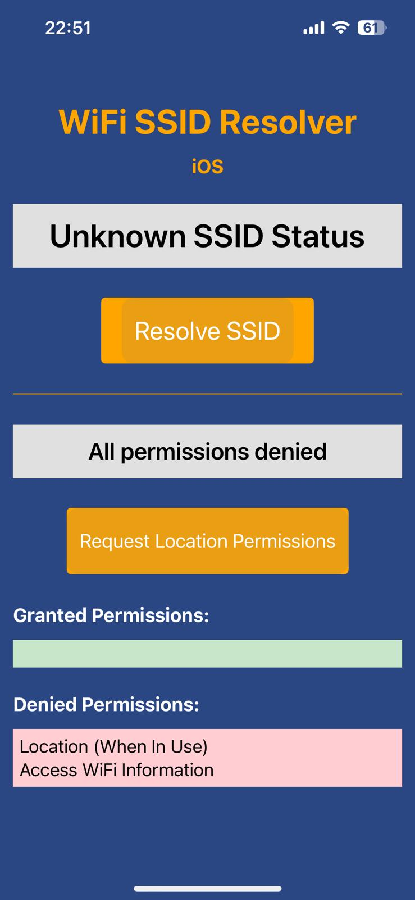
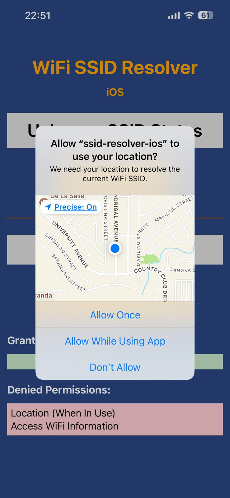
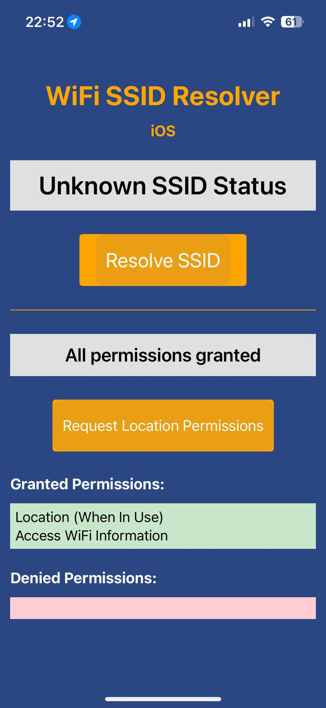
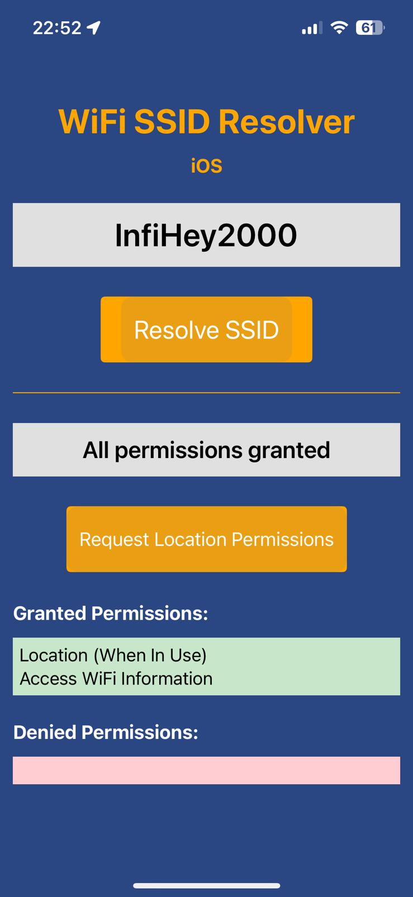
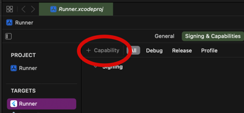
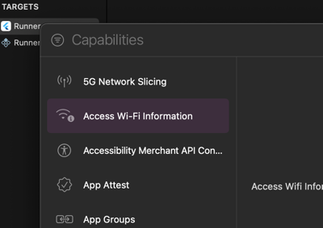

# ssid-resolver-ios - "Get my Wifi Name"

A standalone app to resolve the SSID of the connected WiFi network on iOS, or simply: "Get my Wifi Name". This implementation uses the
latest iOS APIs as of January 2025 and you need a target platform of iOS 15.0 or higher.

This code was created to be wrapped as a Flutter plugin, which you can find here: https://github.com/raoulsson/ssid_resolver_flutter_plugin

## Quick Info

A short implementation that resolves the SSID of the connected WiFi network on iOS.
After failing to get the library network_info_plus to do this, I decided to write my own plugin.
This plugin is not production ready and should be used with caution.

|                                                                                                                                     |                                                                                                                                           |
|-------------------------------------------------------------------------------------------------------------------------------------|-------------------------------------------------------------------------------------------------------------------------------------------|
| <br />Not all permissions granted | <br />OS dialog to grant permissions |
| <br /> All permissions granted        |  <br /> Network SSID resolved                 |


Further relevant methods will be added soon.

## Setting up the plugin for iOS

In order for this to run, you need a target iOS of 15.0 or higher and the location services and wifi-info entitlements.
Add the following to your `<project_root>/ios/Runner/Info.plist` file:

    <key>NSLocationWhenInUseUsageDescription</key>
    <string>This app needs access to location to determine the WiFi information.</string>
    <key>NSLocationUsageDescription</key>
    <string>This app needs access to location to determine the WiFi information.</string>
    <key>NSLocationAlwaysAndWhenInUseUsageDescription</key>
    <string>This app needs access to location to determine the WiFi information.</string>
    <key>com.apple.developer.networking.wifi-info</key>
    <true/>

Open `<project_root>/ios/Runner/Runner.xcodeproj` in XCode and go to "Signing & Capabilities". Add the
"Access WiFi Information" capability.

| Add WiFi Capability 1                                                              | Add WiFi Capability 2                                                              |
|------------------------------------------------------------------------------------|------------------------------------------------------------------------------------|
|  |  |      


This should produce the file `<project_root>/ios/Runner/Runner.entitlements` with this content:

```xml
<?xml version="1.0" encoding="UTF-8"?>
<!DOCTYPE plist PUBLIC "-//Apple//DTD PLIST 1.0//EN" "http://www.apple.com/DTDs/PropertyList-1.0.dtd">
<plist version="1.0">
<dict>
    <key>com.apple.developer.networking.wifi-info</key>
    <true/>
</dict>
</plist>
```

# License

Copyright 2025 Raoul Marc Schmidiger (hello@raoulsson.com)

Permission is hereby granted, free of charge, to any person obtaining a copy of this software and associated documentation files (the “Software”), to deal in the Software without restriction, including without limitation the rights to use, copy, modify, merge, publish, distribute, sublicense, and/or sell copies of the Software, and to permit persons to whom the Software is furnished to do so, subject to the following conditions:

The above copyright notice and this permission notice shall be included in all copies or substantial portions of the Software.

THE SOFTWARE IS PROVIDED “AS IS”, WITHOUT WARRANTY OF ANY KIND, EXPRESS OR IMPLIED, INCLUDING BUT NOT LIMITED TO THE WARRANTIES OF MERCHANTABILITY, FITNESS FOR A PARTICULAR PURPOSE AND NONINFRINGEMENT. IN NO EVENT SHALL THE AUTHORS OR COPYRIGHT HOLDERS BE LIABLE FOR ANY CLAIM, DAMAGES OR OTHER LIABILITY, WHETHER IN AN ACTION OF CONTRACT, TORT OR OTHERWISE, ARISING FROM, OUT OF OR IN CONNECTION WITH THE SOFTWARE OR THE USE OR OTHER DEALINGS IN THE SOFTWARE.
