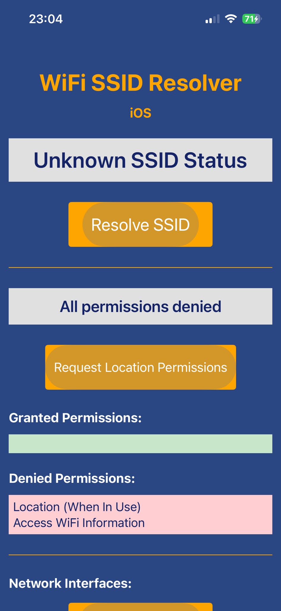
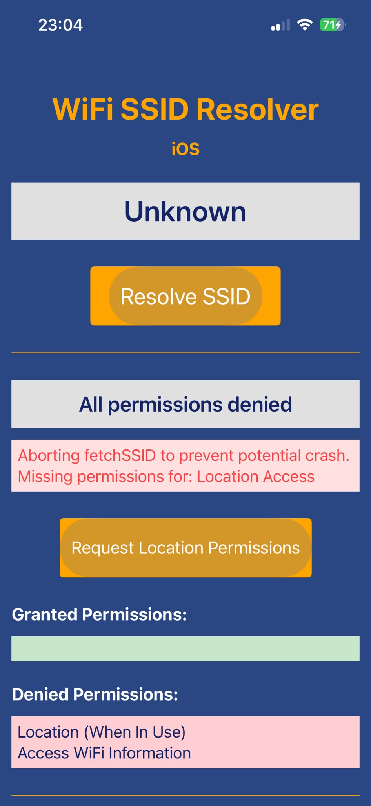
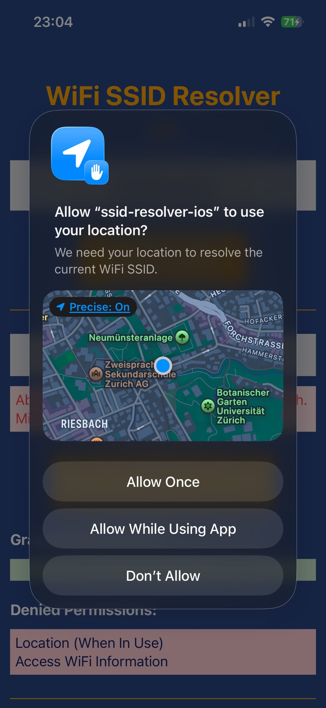
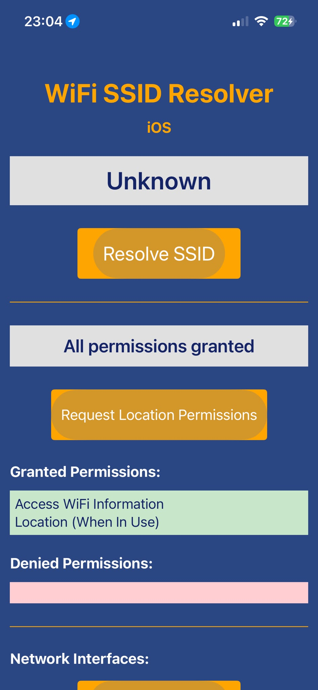
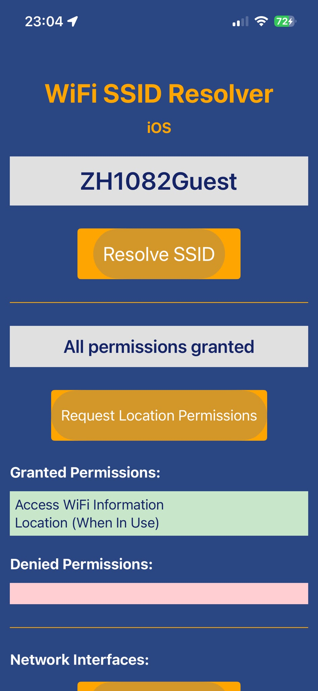
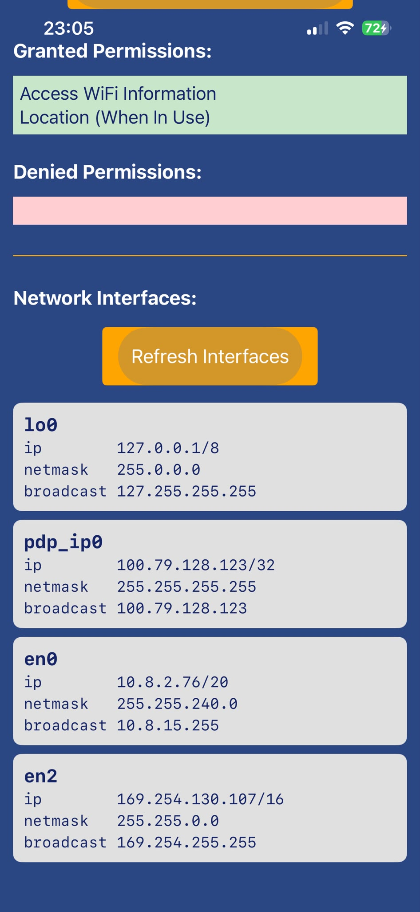
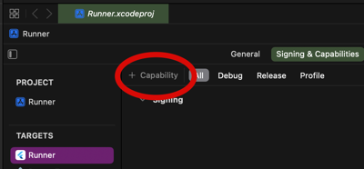
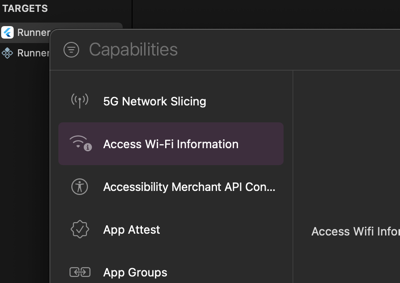

# ssid-resolver-ios - "Get my Wifi Name" 

A standalone app to resolve the SSID of the connected WiFi network on iOS, or simply: "Get my Wifi Name". This implementation uses the
latest iOS APIs as of January 2026 and you need a target platform of iOS 15.0 or higher.

This code was created to be wrapped as a Flutter plugin, which you can find here: https://github.com/raoulsson/ssid_resolver_flutter

> [!IMPORTANT]
> **Version 2.0 - it now tells you the truth about why the SSID is missing, and it can read the netmask.**
>
> Before, a failed lookup always blamed the same thing. `NEHotspotNetwork.fetchCurrent()` returning
> `nil` was treated as proof that the Access WiFi Information entitlement was missing - but that call
> returns `nil` for at least three different reasons: no entitlement, no Wi-Fi connection at all, or a
> network that simply withholds its name, which captive portals, enterprise and many guest networks do.
> The app reported the first one as fact every time, so on a guest network it sent you hunting for an
> entitlement you already had. It now attempts the real fetch first and, when that comes back empty,
> uses the interface table to tell "not on Wi-Fi" apart from "on Wi-Fi, name withheld", and says which.
> The screenshots below are that path end to end, on a real iPhone on a guest network.
>
> Version 2.0 also adds `NetworkInterfaceResolver`, which reports every IPv4 interface with its **real
> netmask** and the broadcast address derived from it. `getifaddrs` needs no entitlement and no
> permission at all, so the interface list works even on a device where Location has been denied and
> the SSID cannot be resolved at all. This matters because without a netmask
> there is no way to compute a broadcast address, and the usual workaround - take the first three
> octets and append `.255` - is only correct on a `/24`. On the `/20` shown below, the real broadcast
> is `10.8.15.255` while that shortcut yields `10.8.2.255`, an ordinary unused host address that
> silently swallows everything sent to it.


## Quick Info

A short implementation that resolves the SSID of the connected WiFi network on iOS.
After failing to get the library network_info_plus to do this, I decided to write my own plugin.
This plugin is not production ready and should be used with caution.

### What it looks like

The full permission path on a physical iPhone, left to right, top to bottom.

|                                                                                                                        |                                                                                                                                    |
|------------------------------------------------------------------------------------------------------------------------|--------------------------------------------------------------------------------------------------------------------------------------|
| <br />**1.** Nothing granted yet - the SSID is simply unknown | <br />**2.** Tapping Resolve says exactly what is missing: Location Access |
| <br />**3.** The OS prompt, explained by `NSLocationWhenInUseUsageDescription` | <br />**4.** Both permissions granted, ready to resolve |
| <br />**5.** Resolved: `ZH1082Guest` | <br />**6.** Interfaces with real netmasks - no permission needed for this list |

Screenshot 6 is worth a second look. `en0` is on a `/20`, so its broadcast is `10.8.15.255` and not
the `10.8.2.255` a `.255` shortcut would produce. `pdp_ip0` is cellular on a `/32`, where the derived
broadcast equals the interface's own address - which is why cellular has to be excluded from any list
of broadcast targets rather than merely looking odd.

Further relevant methods will be added soon.

## Setting up the plugin for iOS

In order for this to run, you need a target iOS of 15.0 or higher and the location services and wifi-info entitlements.
Add the following to your `<project_root>/ios/Runner/Info.plist` file:

    <key>NSLocationWhenInUseUsageDescription</key>
    <string>This app needs access to location to determine the WiFi information.</string>
    <key>NSLocationUsageDescription</key>
    <string>This app needs access to location to determine the WiFi information.</string>
    <key>NSLocationAlwaysAndWhenInUseUsageDescription</key>
    <string>This app needs access to location to determine the WiFi information.</string>
    <key>com.apple.developer.networking.wifi-info</key>
    <true/>

Open `<project_root>/ios/Runner/Runner.xcodeproj` in XCode and go to "Signing & Capabilities". Add the
"Access WiFi Information" capability.

| Add WiFi Capability 1                                                              | Add WiFi Capability 2                                                              |
|------------------------------------------------------------------------------------|------------------------------------------------------------------------------------|
|  |  |      


This should produce the file `<project_root>/ios/Runner/Runner.entitlements` with this content:

```xml
<?xml version="1.0" encoding="UTF-8"?>
<!DOCTYPE plist PUBLIC "-//Apple//DTD PLIST 1.0//EN" "http://www.apple.com/DTDs/PropertyList-1.0.dtd">
<plist version="1.0">
<dict>
    <key>com.apple.developer.networking.wifi-info</key>
    <true/>
</dict>
</plist>
```

# License

Copyright 2025 Raoul Marc Schmidiger (hello@raoulsson.com)

Permission is hereby granted, free of charge, to any person obtaining a copy of this software and associated documentation files (the “Software”), to deal in the Software without restriction, including without limitation the rights to use, copy, modify, merge, publish, distribute, sublicense, and/or sell copies of the Software, and to permit persons to whom the Software is furnished to do so, subject to the following conditions:

The above copyright notice and this permission notice shall be included in all copies or substantial portions of the Software.

THE SOFTWARE IS PROVIDED “AS IS”, WITHOUT WARRANTY OF ANY KIND, EXPRESS OR IMPLIED, INCLUDING BUT NOT LIMITED TO THE WARRANTIES OF MERCHANTABILITY, FITNESS FOR A PARTICULAR PURPOSE AND NONINFRINGEMENT. IN NO EVENT SHALL THE AUTHORS OR COPYRIGHT HOLDERS BE LIABLE FOR ANY CLAIM, DAMAGES OR OTHER LIABILITY, WHETHER IN AN ACTION OF CONTRACT, TORT OR OTHERWISE, ARISING FROM, OUT OF OR IN CONNECTION WITH THE SOFTWARE OR THE USE OR OTHER DEALINGS IN THE SOFTWARE.
